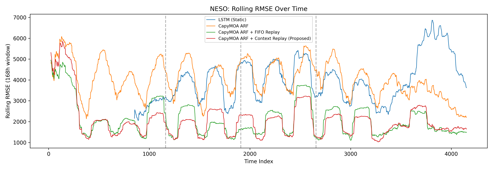
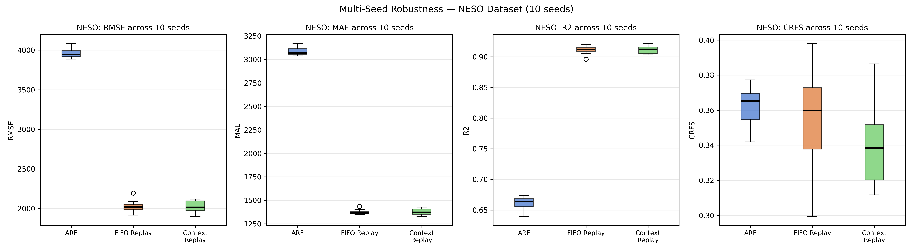
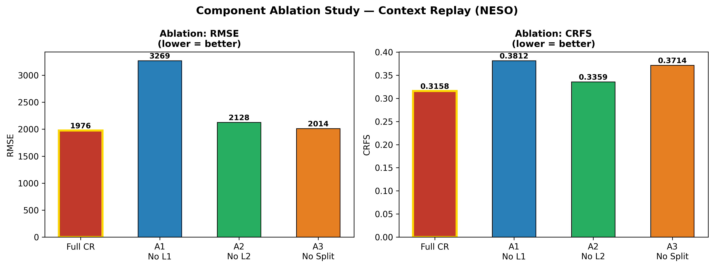

# Context Replay for Online Energy Demand Forecasting

Reproducible experiments for the M.Tech thesis *Context Replay: Overcoming Catastrophic Forgetting in Online Energy Demand Forecasting*.

This repository studies online electricity-demand forecasting under recurring Day/Night regimes. The proposed **Context Replay (CR)** method augments an Adaptive Random Forest (ARF) with separate Day and Night FIFO buffers. At each online update it replays 3 samples from the active context and 7 from the other context; an additional 16-sample burst is used at a context switch near detected drift.

> **Research scope.** The strongest confirmed result is that replay-based CR significantly improves NESO RMSE over plain ARF. The additional CR-versus-FIFO benefit is reported as a directional, exploratory result, not as a statistically proven universal improvement.

## Repository layout

```text
notebooks/context_replay_experiments.ipynb  Reproducible Colab/Jupyter workflow
results/                                    Final exported experiment tables
figures/                                    Selected final figures
requirements.txt                            Python environment
```

## Method

| Component | Final setting |
| --- | --- |
| Base learner | CapyMOA Adaptive Random Forest, 20 trees |
| Drift detection | ADWIN, delta = 0.002 |
| Context | Day: 06:00-17:59; Night: all other hours |
| CR memory | 200 samples per context (400 total) |
| FIFO baseline memory | 400 unified samples |
| Replay budget | CR: 3 same-context + 7 cross-context; FIFO: 10 samples per step |
| Context-switch replay | 16 extra samples; drift memory: 48 steps |
| Evaluation | Prequential (predict, then train); first 20% as warm-up |

The equal 400-sample memory and 10-sample replay budget ensure that the FIFO comparison tests context partitioning rather than extra memory or extra training.

## Data

The notebook retrieves and processes public datasets; raw data is intentionally not redistributed here.

| Dataset | Region | Processed samples | Source |
| --- | --- | ---: | --- |
| NESO Historic Demand | United Kingdom | 4,152 | [NESO Open Data](https://www.neso.energy/data-portal/historic-demand-data) |
| ElectricityLoadDiagrams20112014 | Portugal | 7,832 | [UCI Machine Learning Repository](https://archive.ics.uci.edu/dataset/321/electricityloaddiagrams20112014) |
| NEM NSW demand | Australia | 17,377 | [AEMO Data](https://www.aemo.com.au/energy-systems/electricity/national-electricity-market-nem/data-nem/market-data-nem) |

The AEMO loader includes a synthetic fallback solely for pipeline development if its public endpoint is unavailable. The committed final AEMO results were produced from the real downloaded AEMO records.

## Reproduce

```bash
python -m venv .venv
source .venv/bin/activate
pip install -r requirements.txt
jupyter notebook notebooks/context_replay_experiments.ipynb
```

The notebook may also be opened in Google Colab. Install dependencies in its first cell, restart the runtime, then execute the notebook in order. Full execution downloads public data and is computationally intensive; the final tables and figures are supplied in this repository for inspection.

## Results

Single-seed prequential evaluation (`seed=42`) is reported in [`results/final_results_table.csv`](results/final_results_table.csv).

| Dataset | CR RMSE | FIFO RMSE | CRFS: CR / FIFO |
| --- | ---: | ---: | ---: |
| NESO | 1,976.17 | 2,087.82 | 0.3158 / 0.3721 |
| UCI Electricity | 14,824.81 | 15,588.44 | 0.2691 / 0.2860 |
| AEMO NSW | 546.47 | 553.40 | 0.2744 / 0.2766 |

On NESO multi-seed evaluation (`n=10`), CR versus plain ARF is significant for RMSE (one-sided Wilcoxon signed-rank test: `p=0.0020`, 10/10 seeds). CR versus FIFO is not significant for RMSE (`p=0.7695`) or CRFS (`p=0.1309`, 8/10 directional wins). CRFS should therefore be interpreted as an exploratory measure of context re-entry behavior.







## Citation

If you use this repository, please cite the associated thesis until a peer-reviewed paper is available:

```bibtex
@mastersthesis{chouhan2026context,
  author = {Anand Bhan Singh Chouhan},
  title = {Context Replay: Overcoming Catastrophic Forgetting in Online Energy Demand Forecasting},
  school = {Indian Institute of Information Technology Allahabad},
  year = {2026}
}
```

## License

The code is released under the MIT License. Dataset access and reuse remain subject to the respective providers' terms.
